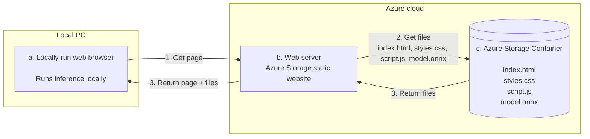
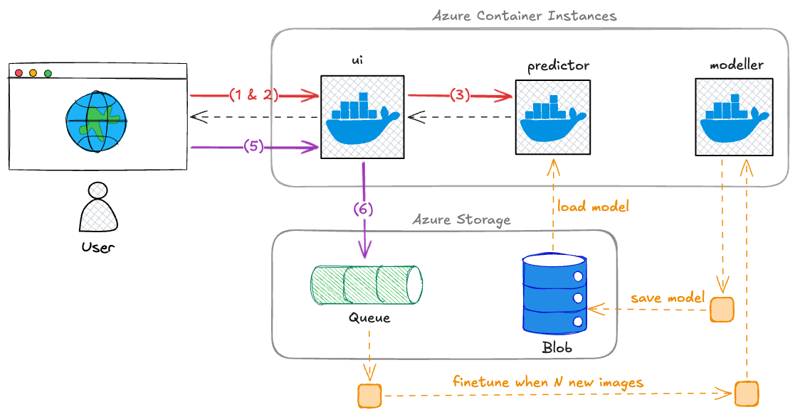

# Johdanto

## Tervetuloa kurssille

Kurssilla käytetään Azurea, joten varmistathan heti alkuvaiheissa, että sinulla on pääsy tarvittaviin palveluihin. Huomaa, että pääsyä ei ole mitenkään automaattisesti, vaan se on annettu alkujaan heille, jotka ovat **ilmoittautuneet Pakki-järjestelmässä kurssille ajoissa**.

1. Kirjaudu HAKA-tunnuksilla [Azure Portaliin](http://portal.azure.com/) ja tutki mitä sieltä löytyy.
2. Varmista, että Azuresta löytyy Reppussa esitelty subscription.
    - Löydät sen etimällä palvelua nimeltään **Subscriptions**
    - Jos oikeaa subscriptionia ei näy, ja luulet että sen pitäisi näkyä, tarkista listan yltä filtterit. Ehkä se on vain piilotettuna.
    - Jos ei vieläkään löydy, olet todennäköisesti unohtanut ilmoittautua kurssille ajoissa. Ota yhteyttä opettajaan, jotta asia saadaan kuntoon.
3. Subscriptionin sisältä löytyy **resource group**, jossa esiintyy sinun nimesi.

!!! tip "Minkä nimistä subscriptionia etsin?"

    Nimi **ei ole** muotoa `KAMK TT00CC71-XXXX Online Learning`, kuten vanhoissa videoissa väitetään! Käytämme nykyään Azure DevOps:ia luomaan pääsyt tiettyyn Azure subscriptioniin, jonka nimi löytyy Reppu-palvelusta. Tämä dokumentti on julkinen, joten en halua julkaista subscriptionin nimeä tässä tietoturvasyistä.

!!! warning "TUHOA!"

    Kurssilla luodaan Azureen maksullisia palveluita. Tuhoa Terraformilla luodut palvelut aina kun lopetat työskentelyn (terraform destroy); luo ne seuraavalla kerralla uusiksi. Jos Terraform herjaa jotakin, käy tuhoamassa resurssit käsin.

## Kurssin vaiheet

Kurssin aikana toteutetaan kaksi vaihetta, joista ensimmäinen keskittyy Terraformin ja Azuren perusteiden opiskeluun, toinen keskittyy Azuren käyttöön tämän kurssin casen kohdalla. Huomaa, että kurssin voisi tehdä Azuressa useita eri palveluita käyttämällä. Tässä toteutuksessa työkaluksi on valittu *Azure Container Instances (ACI)*. Päällimmäinen syy tälle on, että **se muistuttaa Docker Compose Projectia**, joka on opiskelijoille jo entuudestaan tuttu. Yksittäinen *container instance* on hyvin lähelle sama asia kuin docker compose project: servicet/kontit ovat keskenään lähiverkossa, mutta niihin pääsee käsiksi ulkopuolelta, mikäli siihen aukoo portteja. Jos pystyttäisit tuotantoa varten vastaavan ratkaisun, voisit päätyä hyvin eri Azure-palveluihin: tällöin todennäköisesti sekä tuntihinta että toteutuksen monimutkaisuus kasvaisivat merkittävästi.

### Vaihe 1: IaC Terraform Workshop

Kurssin ensimmäisessä vaiheessa (Vaihe 1 ja sen osat 1A ja 1B) tutustutaan Terraformin ja Azuren käyttöön muutamalla erilaisella harjoituksella. Vaihe 1A sisältää Janin luennot ja esimerkkikoodit Azure instanssien Blob storage ja Virtual Machine -käyttöön. 

**Kuva 1:** *Yksinkertainen IaC Workshop Lesson 1:stä tuttu arkkitehtuuri. Huomaa, että erillistä "web serveriä" ei kuitenkaan ole Azuressa palveluna. Kyseessä on Azure Storagen sisäinen, staattinen website server.*

Alla linkit IaC Terraform -workshopin koodeihin sekä luentovideoihin. Katso videot ja tee perässä. Muista tuhota resurssit workshopin päätteeksi.

- [GitLab: IaC Terraform](https://gitlab.dclabra.fi/workshopit/iac-terraform)
- [YouTube: IaC Terraform](https://www.youtube.com/playlist?list=PL7AbISYtmmfiwaZSYNwIW-pDIOV17QNit)

### Vaihe 2: Drawhello ja Flowermodel

Vaiheessa kaksi luomme monimutkaisemman kokonaisuuden, jonka esikuvana toimii opettajan luoma äärimmäisen simppeli Drawhello-tekoäly. Tämä koostuu osista 2A (opettajan drawhello-esimerkki), 2B (sinun tekemäsi flowermodel) ja 2C, joka on lisähaaste liittyen kokonaisuuden automatisointiin skriptauksen avulla.

**Kuva 2:** *Kuvan arkkitehtuuri esittää Vaihe 2A:n lopputuotosta. Osa palveluista on kontteja Azure Container Instances (ACI)-palvelussa. Näitä ovat: `ui` (Streamlit), `predictor` (FastAPI) ja `modeller` (Python + ML-kirjasto). Object storage ja Storage Queue ovat Azuren hallinnoimia palveluita, ja kuuluvat Azure Storage -perheeseen, joten ne ovat yhden Azure Storage (Account) -laatikon sisällä.*

Yllä oleva Kuva 2 pyrkii hahmottamaan vaiheen 2A lopputuotosta. Tältä pohjalta sinä muokkaat sinun oman 2B-osan. 2A-osan kuvaus on sanallisesti ja värikoodattujen nuolien avulla. Aloitetaan punaisista nuolista, jotka kuvaajat käyttäjän käynnistämää ennusteen tekoa:

1. Käyttäjä avaa selaimella `https://something.azurewebsites.net/`-osoitteen. `ui` palauttaa käyttöliittymän HTML-muodossa.
2. Käyttäjä luo syötteen (esim. piirtää "Hello"-tekstin piirustuslaatikkoon) ja painaa "Predict"-nappia.
3. `ui` kutsuu backendiä nimeltään `predictor` ja välittää sille syötteen (esim. piirroksen).
4. Tässä välissä on kaksi mustaa paluunuolta: ennuste palaa käyttäjälle.
5. Käyttäjä voi halutessaan hyväksyä ennusteen ("Kyllä, tekstissä luki HELLO") tai hylätä sen ("Ei, tekstissä luki WORLD"). Hän tekeen näin, ja tämä `POST`-kutsu menee `predictor`-palveluun.
6. `predictor` välittää Queue-palveluun viestin, joka sisältää `(IMAGE_DATA, LABEL)`-parin.

Kuvaajassa on myös numeroimattomia oransseja katkonuolia. Nämä kuvastavat sitä osuutta taustapalveluita, joiden kanssa käyttäjä ei suoraan ole vuorovaikutuksessa. Niiden keskiössä on `modeller`-palvelu, joka:

* Lukee ajoittain Queue-palvelusta uusia `(IMAGE_DATA, LABEL)`-pareja.
* Jos uusia pareja on yli kynnysarvon `N`, se... 
    * noutaa kuvat Queue-palvelusta,
    * fine-tunaa mallin,
    * ja tallentaa uuden mallin Azure Storageen.

Vastaavasti `predictor`-palvelu käy ajoittain tarkistamassa, onko Azure Storagessa uutta mallia. Jos on, se hakee sen ja ottaa käyttöönsä. Muutoin se käyttää vanhaa mallia, joka sillä on muistissaan. Käyttäjälle tämä on täysin näkymätöntä.

!!! tip

    Mitä sinä sitten teet? Noh, annetussa esimerkissä on käytössä `scikit-learn`, jolla koulutetaan täysin naiivi logistinen regressio tunnistamaan binärisöidyn kuvan avulla teksti "HELLO" tai "WORLD". Annetussa esimerkissä kuva pienennetään 40x20 kokoon, ja nämä 800 pikseliä syötetään jonopalveluun merkkijonona muotoa: `101010101...(800 merkkiä)...010101`. Tämä on tarkoituksellisen huono ratkaisu!

    Sinun tehtäväsi on ottaa Syväoppiminen II -kurssilla koulutettu FlowerModel, joka tunnistaa kukkalajit kuvien perusteella PyTorch [MobileNet V3 Small](https://docs.pytorch.org/vision/main/models/generated/torchvision.models.mobilenet_v3_small.html) -arkkitehtuuria hyödyntäen. Arkkitehtuuri vaatii 224x224 RGB-kuvan, ja sitä ei ole mitään järkeä yrittää survoa Queue-palveluun, johon ei voi lisätä 64 KB suurempaa dataa (base64-enkoodattuna, jossa on overheadia). Siispä sinun tulee lähtökohtaisesti:

    * Tallentaa kuva Blob Storageen.
    * Välittää Queue-palveluun kuvan URL ja label.

    On sinun valintasi, tekeekö tämän Blob-tallennuksen `ui`-palvelu, vai siirrätkö tämän koko logiikan `predictor`-palveluun, jolloin `ui`-kontin pyörittämältä Streamlitiltä poistuisi kokonaisuudessaan tarve kommunikoida Azure Storage -palveluiden kanssa.
