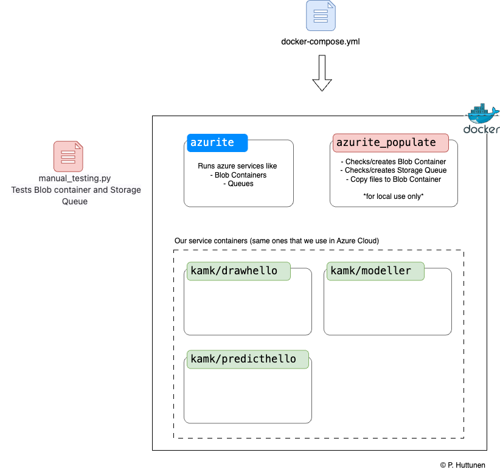
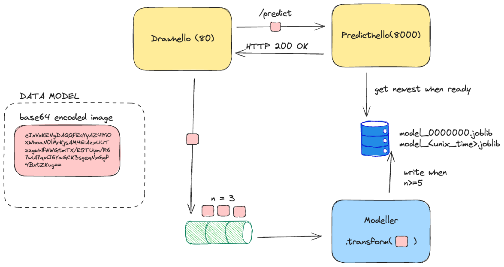

# 2A: Drawhello ja Azurite

!!! note

    Muistathan tehdä nämä oikeat harjoitustyöt suoraan kurssin repositorioon.

!!! warning

    Muistathan tuhota resurssit kun lopetat työskentelyn! Saat ne myöhemmin takaisin `terraform apply`-komennolla, mikäli tarvitset. Ethän kuluta resursseja turhaan.

## Mitä olemme tekemässä?

Kurssin toisessa osassa (2A ja 2B) jatketaan Terraformin ja Azuren käyttöä rakentamalla suurempi kokonaisuus, jossa on useita kontteja, jotka muodostavat keskenään mikropalveluarkkitehtuuria noudattavan kokonaisuuden. Vaihe 2A on opettajan esimerkki (Drawhello). Vaiheessa 2B muokkaat (tai luot kokonaan alusta) oman toteutuksesi.

## 2A: Drawhello

Opettajan tallentamat luennot ja opettajan esimerkki sisältää ympäristön, jossa ajetaan ja jatkokoulutetaan logistista regressiota tekevää yksinkertaista palvelua. Kokonaisuus **ennustaa käsin kirjoitetuja sanoja "Hello" ja "World" pikselidatan perusteella.** 

### Arkkitehtuuri

**Kuva:** *Kuvassa Pekka Huttusen piirtämänä arkkitehtuuri. Huomatkaa, että Azurite on palvelu, joka matkii Azuren tiettyjä rajapintoja. Se mahdollistaa sen, että voimme ajaa meidän service containereita ilman että mockkaamme Azuren palveluita itse - täysin offline.*

**Kuva:** *Kuvassa Jani Souranderin piirtämä arkkitehtuuri hieman eri näkökulmasta. Tämä graafi esiintyy mitä todennäköisemmin kurssin YouTube-videoilla. Graafissa on esitetty eri mikropalveluiden välinen kommunikaatio, ja unohdettu se, missä jonoa tai object storagea ajetaan. Putki-ikoni ja tynnyrinmuotoinen levypino voivat siis olla Azuritessa tai Azuressa. Kolme mikropalvelua voivat sen sijaan olla kontteja Docker Compose -projektissa tai Azuren Container Instances -palvelussa: ne toimivat hyvin samalla tavalla.*

Koko systeemi koostuu seuraavista mikropalveluista:

* Front: **drawhello** (`src/drawhello`) app serving User Interface (Streamlit)
* Back: **predicthello** (`src/predicthello`) app serving the prediction API (FastAPI, Scikit learn)
* Modeller: **modeller** (`src/modeller`). a job-like script that trains the model and saves it to Azure Blob Storage using polling strategy (Scikit Learn, while loop)

Nämä kaikki voidaan ajaa lokaalisti (käyttäen `docker compose up`) tai Azuren pilvessä. Jälkimmäiseen tarvitset Terraformilla kaksi eri projektia, jotka löytyvät `./infra/tf/**/*.tf`-polusta.

### Paikallinen työskentely (Azurite)

Huom. Vaiheet eivät ole täysin samassa järjestyksessä kuin videoissa.

1. Tutki mistä löydät yllä olevan kuvan mukaisen docker-compose.yml tiedoston ja kansiot, joissa omat kontit on määritelty.  
2. Asenna koneelle Azure Storage Explorer ja luo oma repo kurssin palautusta varten. 
    - kts. ohjeet videolta "Luento 2 | Storage Explorer (1/2)"
3. Lähde toistamaan mukana paikallisen Azurite palvelun rakentamista omaan repoosi. 
    - kts. ohjeet videoilta "Luento 2 | Azurite (2/2)" ja "Luento 3 | Local Drawhello (1/1)"
    - Huom. Oppimisen kannalta voi olla hyvä vaihtaa konttien nimet omiin versioihin niistä & lisätä kommentteja tiedostoihin niitä luotaessa.
    - Varmista, että saat auki paikallisen käyttöliittymän ja että löydät kuvat jonosta käyttäen Azure Storage Explorer:a.

4. Toista tässä välissä valmiin Azure esimerkin ajaminen esimerkkireposta 
    - kts. ohjeet videolta "Luento 1 | Projektin yleiskatsaus (1/1)"
    - Huom. Muista käyttää omaa identifieriä!

### Pilvityöskentely (Azure)

Kun kontit ja kokonaisuus toimii omalla koneellasi, sinun tarvitsee enää vain puskea imaget Azureen ja luoda tarvittavat palvelut. Tämä neuvotaan videoilla.

Varmista, että:

* Saat auki käyttöliittymän, 
* ennustus toimii, 
* Uudelleenkoulutus toimii,
* Pystyt selaamaan jonon ja blobin Azure Storage Explorerilla ja 
* Löydät kontit Azure palvelun nettisivulta.

HUOM! Kurssilla luodaan Azureen maksullisia palveluita. Tuhoa Terraformilla luodut palvelut aina kun lopetat työskentelyn (terraform destroy); luo ne seuraavalla kerralla uusiksi. Jos Terraform herjaa jotakin, käy tuhoamassa resurssit käsin.